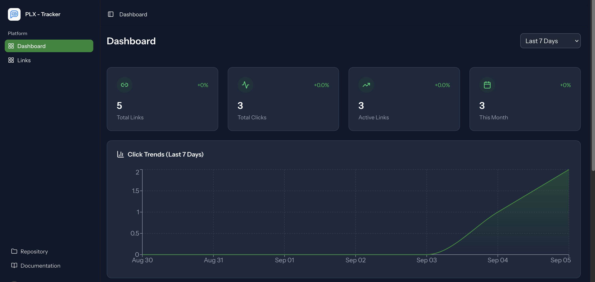

# PLX-Track 🚀

[](https://opensource.org/licenses/MIT)
[](https://laravel.com)
[](https://reactjs.org)
[](https://php.net)

A powerful, self-hosted URL shortening platform with comprehensive analytics. Built with Laravel, Inertia + React (TypeScript), and modern web technologies.

## ✨ Features

### 🔗 URL Management

## Screenshots

Dashboard view:


### 📊 Advanced Analytics
- **Real-time Click Tracking** - Monitor every click with detailed metadata
- **Time-based Analytics** - Hourly and daily click patterns
- **Date Range Filtering** - Custom analytics periods
- **Public Analytics Pages** - Shareable analytics dashboards

### 🎨 Modern Interface
- **Responsive Design** - Mobile-first, works on all devices
- **Dark/Light Theme** - Complete theme switching support
- **Real-time Updates** - Client updates via Inertia + React (TanStack Query)
- **Professional UI** - Built with Flux UI components
- **Smooth Animations** - Polished user experience

### 🔐 User Management
- **Secure Authentication** - Email verification and password reset
- **User Dashboard** - Personal analytics overview
- **Link Organization** - Efficient link management interface

## 🚀 Quick Start

### Prerequisites
- PHP 8.2 or higher
- Composer
- Node.js & NPM
- SQLite (default) or MySQL/PostgreSQL

### Installation

1. **Clone the repository**
   ```bash
   git clone https://github.com/palactix/plx-track.git
   cd plx-track
   ```

2. **Install PHP dependencies**
   ```bash
   composer install
   ```

3. **Install Node.js dependencies**
   ```bash
   npm install
   ```

4. **Environment setup**
   ```bash
   cp .env.example .env
   php artisan key:generate
   ```

5. **Database setup**
   ```bash
   php artisan migrate
   php artisan db:seed
   ```

6. **Build assets**
   ```bash
   npm run build
   ```

7. **Start the development server**
   ```bash
   php artisan serve
   ```

Visit `http://localhost:8000` to access PLX-Track!

## 🔧 Configuration

### Environment Variables

Key environment variables to configure:

```env
# Application
APP_NAME="PLX-Track"
APP_URL=http://localhost:8000

# Database
DB_CONNECTION=sqlite
DB_DATABASE=/absolute/path/to/database/database.sqlite

# Mail (for notifications)
MAIL_MAILER=smtp
MAIL_HOST=your-smtp-host
MAIL_PORT=587
MAIL_USERNAME=your-email
MAIL_PASSWORD=your-password

# GeoIP (optional - for location tracking)
GEOIP_SERVICE=ipapi
```

### Database Options

PLX-Track supports multiple databases:

- **SQLite** (default) - Perfect for small to medium installations
- **MySQL** - For larger deployments
- **PostgreSQL** - For advanced features

## 📱 Usage

### Creating Short Links

1. Navigate to the Links page
2. Enter your long URL
3. Optionally customize the short code
4. Add title, description, or password protection
5. Click "Shorten URL"

### Viewing Analytics

- **From Links List**: Click the analytics icon next to any link
- **Direct Access**: Visit `/analytics/{linkId}` directly
- **Public Analytics**: Share analytics with `/public/{shortCode}/analytics`

### Managing Links

- **Edit**: Update URL, title, or settings
- **Toggle Status**: Enable/disable links
- **Bulk Actions**: Manage multiple links at once
- **Export Data**: Download analytics as CSV

## 🛠️ Development

### Tech Stack

- **Backend**: Laravel 11.x
- **Frontend**: React + TypeScript, Inertia.js, Tailwind CSS, Chart.js
- **Database**: SQLite/MySQL/PostgreSQL
- **UI Components**: Flux UI

### Project Structure

```
app/
├── Http/Controllers/     # HTTP request handlers
├── Livewire/            # (If present) legacy Livewire components
├── Models/              # Eloquent models
├── Services/            # Business logic services
└── Jobs/                # Background job processing

resources/views/
├── components/          # Blade components
├── livewire/           # Livewire component views
└── layouts/            # Layout templates

database/
├── migrations/         # Database schema
├── seeders/           # Test data seeders
└── factories/         # Model factories
```

### Development Setup

1. **Install development dependencies**
   ```bash
   composer install --dev
   npm install
   ```

2. **Run tests**
   ```bash
   php artisan test
   ```

3. **Start development servers**
   ```bash
   # Laravel development server
   php artisan serve

   # Asset compilation (watch mode)
   npm run dev
   ```

4. **Generate test data**
   ```bash
   php artisan db:seed --class=AnalyticsTestSeeder
   ```

### Code Style

We follow Laravel coding standards:

- **PSR-12** coding standard for PHP
- **Prettier** for JavaScript formatting
- **Blade** formatting for templates

Run code formatting:
```bash
# PHP
./vendor/bin/pint

# JavaScript/CSS
npm run format
```

## 🤝 Contributing

We welcome contributions! Please follow these guidelines:

### 🐛 Bug Reports

When filing a bug report, please include:

1. **Clear description** of the issue
2. **Steps to reproduce** the problem
3. **Expected vs actual behavior**
4. **Environment details** (PHP version, Laravel version, browser)
5. **Screenshots** if applicable

### ✨ Feature Requests

For new features:

1. **Check existing issues** to avoid duplicates
2. **Describe the use case** and benefits
3. **Provide implementation suggestions** if possible
4. **Consider backward compatibility**

### 🔧 Pull Requests

Before submitting a PR:

1. **Fork the repository** and create a feature branch
2. **Write tests** for new functionality
3. **Follow coding standards** (run `./vendor/bin/pint`)
4. **Update documentation** if needed
5. **Ensure tests pass** (`php artisan test`)

#### PR Guidelines

- **Small, focused changes** are preferred
- **Clear commit messages** following conventional commits
- **Reference related issues** in PR description
- **Include screenshots** for UI changes

### 🧪 Testing

We maintain high test coverage:

```bash
# Run all tests
php artisan test

# Run specific test suite
php artisan test --testsuite=Feature

# Run with coverage
php artisan test --coverage
```

### 📚 Documentation

Help improve documentation:

- **API documentation** - Document new endpoints
- **User guides** - Help with user-facing features
- **Developer docs** - Technical implementation details
- **Deployment guides** - Production setup instructions

### Docker Deployment

Coming soon! We're working on official Docker images for easy deployment.

## 📊 Analytics Features

### Click Tracking
- **Real-time processing** via background jobs
- **IP-based geolocation** (requires GeoIP service)
- **User agent parsing** for device/browser detection
- **Referrer tracking** for traffic source analysis

### Chart Types
- **Bar Charts** - Daily click volumes
- **Line Charts** - Hourly distribution patterns
- **Data Tables** - Detailed breakdowns by country, device, browser


## 🔒 Security

### Security Features
- **CSRF protection** on all forms
- **SQL injection prevention** via Eloquent ORM
- **XSS protection** with Blade templating
- **Rate limiting** on public endpoints
- **Secure password hashing** with bcrypt

### Reporting Security Issues

Please report security vulnerabilities privately:
- **Email**: security@jitendra.dev
- **Use GitHub Security tab** for responsible disclosure

## 📄 License

PLX-Track is open-sourced software licensed under the [MIT license](https://opensource.org/licenses/MIT).

## 🙏 Acknowledgments

- **Laravel Team** - For the amazing framework
- **React & Inertia teams** - For modern client-side rendering and routing
- **Flux UI** - For beautiful UI components
- **Chart.js** - For interactive charts
- **Community Contributors** - For making this project better

## 🔗 Links

- **Website**: [https://jitendra.dev](https://jitendra.dev)
- **Documentation**: [Wiki](https://jitendra.dev/)
- **Issues**: [GitHub Issues](https://github.com/palactix/plx-track/issues)
- **Discussions**: [GitHub Discussions](https://github.com/palactix/plx-track/discussions)

## 📞 Support

- **Documentation**: Check our [Wiki](https://jitendra.dev/)
- **Community**: Join our [Discussions](https://github.com/palactix/plx-track/discussions)
- **Issues**: Report bugs via [GitHub Issues](https://github.com/palactix/plx-track/issues)
- **Contact**: reach out on [Twitter](https://twitter.com/_jitendraM)

---

Made with ❤️ by [Jitendra Meena](https://jitendra.dev) and the PLX-Track community.

⭐ **Star this repo** if you find it helpful!
